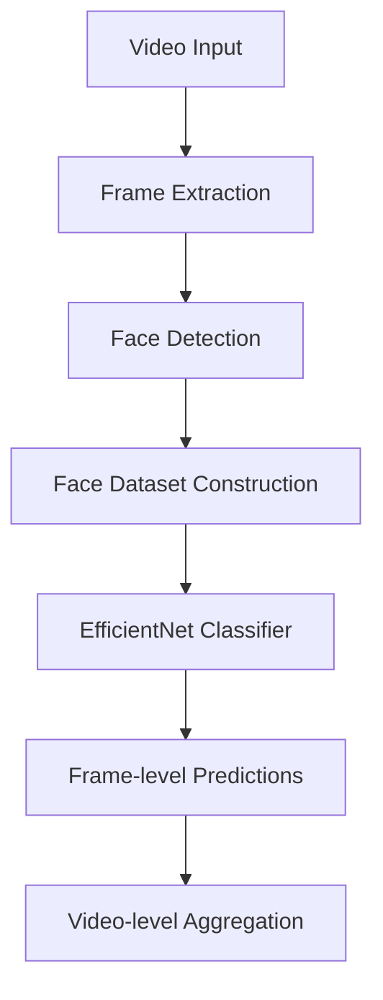

# DeepFake Detection with EfficientNet

A deep learning pipeline for detecting **deepfake videos** using face-level classification and video-level aggregation.

The system extracts faces from video frames, classifies them using a convolutional neural network, and aggregates frame predictions to produce a final video-level decision.

This project demonstrates a **complete machine learning workflow**, including data preprocessing, training, evaluation, and inference.

---

# Project Pipeline



---

# Project Structure

```
DeepFake-Detection
│
├── checkpoints             # saved models
│   └── best_model.pth
│
├── data                    # dataset directory
│
├── runs                    # TensorBoard logs
│   └── deepfake
│
├── scripts                 # preprocessing scripts
│   ├── extract_frames.py
│   ├── detect_faces.py
│   ├── split_dataset.py
│   └── build_frame_dataset.py
│
├── src                     # main source code
│   ├── datasets
│   │   ├── deepfake_dataset.py
│   │   └── build_dataloader.py
│   │
│   ├── models
│   │   └── deepfake_model.py
│   │
│   ├── training
│   │   ├── train.py
│   │   └── trainer.py
│   │
│   ├── evaluation
│   │   └── video_predict.py
│   │
│   └── utils
│       └── metrics.py
│
├── requirements.txt
├── LICENSE
└── README.md
```

---

# Dataset

The dataset consists of **face crops extracted from real and fake videos**.

Images are organized as:

```
data/
  train/
    real/
    fake/

  val/
    real/
    fake/

  test/
    real/
    fake/
```

Each image corresponds to a face extracted from a video frame.

Dataset splitting is performed at the **video level** to prevent frame leakage between training and evaluation sets.

---

# Model

The classifier uses **EfficientNet-B0** pretrained on ImageNet.

Architecture:

```
EfficientNet-B0 (pretrained)
        ↓
Dropout (0.3)
        ↓
Linear Layer (2 classes)
```

The model predicts whether a face image is **real or fake**.

---

# Data Augmentation

Training images are augmented with:

* Random cropping
* Horizontal flipping
* Color jitter
* Gaussian blur

Validation and test sets use deterministic transforms (resize + center crop).

---

# Training

Run training with:

```
python -m src.training.train
```

Training uses:

* CrossEntropyLoss
* Adam optimizer
* mini-batch training
* TensorBoard logging

The best model checkpoint is saved to:

```
checkpoints/best_model.pth
```

---

# Evaluation

Video-level evaluation aggregates predictions from multiple frames.

Run evaluation with:

```
python -m src.evaluation.video_predict
```

Evaluation pipeline:

1. Group frames by video
2. Predict fake probability per frame
3. Aggregate probabilities
4. Produce final video prediction

---

# Results

Quick training (3 epochs):

Frame-level validation performance:

Accuracy: 0.568
F1 Score: 0.576
AUC: 0.606

Video-level evaluation (1000 sampled videos):

Accuracy: 0.448

**Note**: These baseline results are from early training stages. Higher accuracy is expected after 15+ epochs with backbone unfreezing.

---

# Requirements

Install dependencies:

```
pip install -r requirements.txt
```

Main dependencies:

* PyTorch
* Torchvision
* NumPy
* Pillow
* scikit-learn
* tqdm
* facenet-pytorch
* TensorBoard


---

# Future Improvements

Possible improvements include:

* Fine-tuning the EfficientNet backbone
* Temporal modeling for video understanding
* Face tracking across frames
* Larger datasets
* Transformer-based architectures